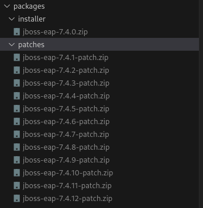

# How to create a Red Hat JBoss Enterprise Application Platform (EAP) using Ansible and RHEL
This Ansible script serves as the default implementation for setting up a JBoss EAP Cluster with an Apache mod_cluster load balancer. Prior to initiating the installation procedure, ensure that all prerequisites are met. Customize this script to tailor the default configurations according to your specific needs.

## Requeriments

* Bastion Server.
* Host 1 - A Virtual Machine RHEL 9.2 for Domain Controller Server.
* Hosts 2, 3, 4 - Virtual Machines RHEL 9.2 for Workservers.
* Hosts 5 and 6 - Virtual Machines RHEL 9.2 for load balancer. 
* Ansible [core 2.14.8].
* JBoss EAP 7.4.

## Summary

## Downloading JBoss EAP 
This section outlines the steps to download JBoss EAP and apply patches for updates.

### Installer
1. The first step entails downloading the JBoss EAP server from the ([Red Hat Customer Portal](https://access.redhat.com)).
2. Save the ZIP file into the 'packages/installer' folder within your script directory.

### Paches
This step is not necessary if you do not intend to apply updates to JBoss EAP patches; however, we highly recommend updating to the latest version. For this tutorial, the current version is 7.4.12.

1. The first step entails downloading the JBoss EAP Pacthes from the ([Red Hat Customer Portal](https://access.redhat.com)).
2. Save the ZIP file into the 'packages/patches' folder within your script directory.

## Ansible Script

The Ansible script is structured into three primary folders, group_vars, packages, roles:
.<br/>
├── group_vars<br/>
├── packages<br/>
│   ├── installer<br/>
│   └── patches<br/>
└── roles<br/>
    ├── domain-controller<br/>
    │   ├── config<br/>
    │   └── tasks<br/>
    ├── jboss-eap<br/>
    │   └── tasks<br/>
    ├── jboss-hosts<br/>
    │   ├── config<br/>
    │   └── tasks<br/>
    ├── jboss-patch-apply<br/>
    │   └── tasks<br/>
    ├── mod-cluster<br/>
    │   ├── config<br/>
    │   └── tasks<br/>
    ├── mod-cluster-registry<br/>
    │   └── tasks<br/>
    ├── subscription<br/>
    │   └── tasks<br/>
    └── update-rhel<br/>
        └── tasks<br/>

### Folder group_vars

In the "group_vars" folder, we house global environment variables. These variables are defined in the "all.yml" file, allowing you to modify default values as per your specific requirements.

```yaml
# This file contains the variables that are common to all the hosts
JBOSS_USER: 'jboss-eap'
OPENJDK_VERSION: 'java-11-openjdk.x86_64' #VALID VALUES 'java-17-openjdk.x86_64', java-11-openjdk.x86_64, java-1.8.0-openjdk.x86_64
EAP_FILE_INSTALL: 'jboss-eap-7.4.0.zip'
WORKDIR: '/opt'
ADMIN_PASSWORD: '1Password!'
USER_ADMIN_NAME: 'admin-user'
USER_ADMIN_NAME_HOST01: 'host01'
USER_ADMIN_NAME_HOST02: 'host02'
USER_ADMIN_NAME_HOST03: 'host03'
JBOSS_HOME: '/opt/jboss-eap-7.4'
APACHE_USER: 'apache'
MOD_CLUSTER_VERSION: mod_proxy_cluster.x86_64
```

### Folder packages
In this folder, you will find the downloaded JBoss EAP Installer and patches available for updating your cluster. For instance:



## Architeture Concepts 

## Cluster EAP

## Load Balancer

## Executing script

## Related Guides

