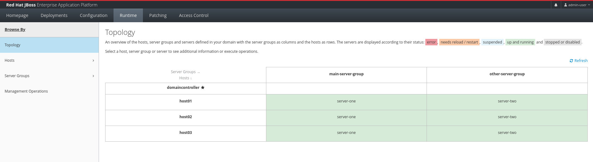
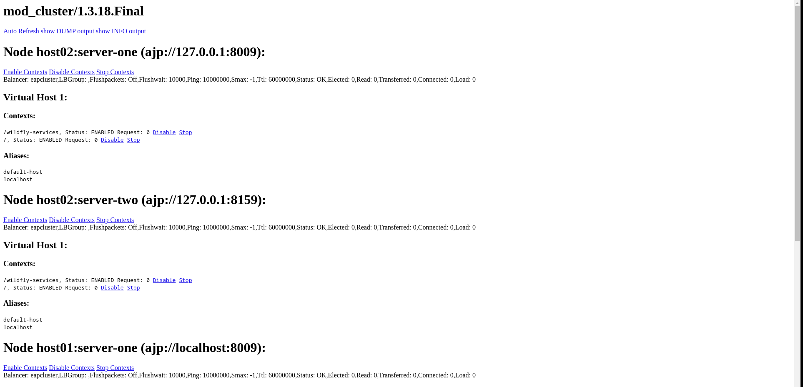

# How to create a Red Hat JBoss Enterprise Application Platform (EAP) using Ansible and RHEL
This Ansible script serves as the default implementation for setting up a JBoss EAP Cluster with an Apache mod_cluster load balancer. Prior to initiating the installation procedure, ensure that all prerequisites are met. Customize this script to tailor the default configurations according to your specific needs.

## Requeriments

* Bastion Server.
* Host 1 - A Virtual Machine RHEL 9.2 for Domain Controller Server.
* Hosts 2, 3, 4 - Virtual Machines RHEL 9.2 for Work Nodes.
* Hosts 5 and 6 - Virtual Machines RHEL 9.2 for load balancer. 
* Ansible [core 2.14.8].
* JBoss EAP 7.4.

## Summary

## Downloading JBoss EAP 
This section outlines the steps to download JBoss EAP and apply patches for updates.

### Installer
1. The first step entails downloading the JBoss EAP server from the ([Red Hat Customer Portal](https://access.redhat.com)).
2. Save the ZIP file into the 'packages/installer' folder within your script directory.

### Paches
This step is not necessary if you do not intend to apply updates to JBoss EAP patches; however, we highly recommend updating to the latest version. For this tutorial, the current version is 7.4.12.

1. The first step entails downloading the JBoss EAP Pacthes from the ([Red Hat Customer Portal](https://access.redhat.com)).
2. Save the ZIP file into the 'packages/patches' folder within your script directory.

## Ansible Script

The Ansible script is structured into three primary folders, group_vars, packages, roles:
.<br/>
├── group_vars<br/>
├── packages<br/>
│   ├── installer<br/>
│   └── patches<br/>
└── roles<br/>
    ├── domain-controller<br/>
    │   ├── config<br/>
    │   └── tasks<br/>
    ├── jboss-eap<br/>
    │   └── tasks<br/>
    ├── jboss-hosts<br/>
    │   ├── config<br/>
    │   └── tasks<br/>
    ├── jboss-patch-apply<br/>
    │   └── tasks<br/>
    ├── mod-cluster<br/>
    │   ├── config<br/>
    │   └── tasks<br/>
    ├── mod-cluster-registry<br/>
    │   └── tasks<br/>
    ├── subscription<br/>
    │   └── tasks<br/>
    └── update-rhel<br/>
        └── tasks<br/>

### Folder group_vars

In the "group_vars" folder, we house global environment variables. These variables are defined in the "all.yml" file, allowing you to modify default values as per your specific requirements.

```yaml
# This file contains the variables that are common to all the hosts
JBOSS_USER: 'jboss-eap'
OPENJDK_VERSION: 'java-11-openjdk.x86_64' #VALID VALUES 'java-17-openjdk.x86_64', java-11-openjdk.x86_64, java-1.8.0-openjdk.x86_64
EAP_FILE_INSTALL: 'jboss-eap-7.4.0.zip'
WORKDIR: '/opt'
ADMIN_PASSWORD: '1Password!'
USER_ADMIN_NAME: 'admin-user'
USER_ADMIN_NAME_HOST01: 'host01'
USER_ADMIN_NAME_HOST02: 'host02'
USER_ADMIN_NAME_HOST03: 'host03'
JBOSS_HOME: '/opt/jboss-eap-7.4'
APACHE_USER: 'apache'
MOD_CLUSTER_VERSION: mod_proxy_cluster.x86_64
```

### Folder packages
In this folder, you will find the downloaded JBoss EAP Installer and patches available for updating your cluster. For instance:


### Folder roles

The Ansible scripts are structured into roles, including:

* subscription: This role focuses on attaching Red Hat subscriptions to the RHEL systems. It involves tasks to attach specific subscriptions based on requirements and business needs.
* update-rhel: This role focuses in update the Operational System.
* jboss-eap: This role prepares all JBoss EAP virtual machines for installation. It creates default JBoss EAP users, installs the specified version of OpenJDK as environment variables, and copies JBoss EAP to the virtual machine's file system.
* domain-controller: This role configures the domain controller host (host01) to prepare it to receive connections from JBoss work nodes (host02, host03 and host04).
* jboss-patch-apply: This role applies patch files across all JBoss EAP hosts.
* jboss-host:This role configures JBoss EAP work nodes for integration into the cluster.
* mod-cluster: This role will install and configure Apache Mod-Cluster on the instances (host05 and host06).
* mod-cluster-registry: This role will register all JBoss EAP instances with the Mod-Cluster load balancer.

All roles can be adapted as needed, and new custom roles can be created and utilized in the install.yml file located in the project's root folder. Let's examine the contents of the install.yml file:

### Files install.yml and host


In the **install.yml** file, you have the ability to declare additional roles to enhance the script's functionality:

```yaml
- hosts: all
  remote_user: root
  become: yes
  become_method: sudo
  roles:
    - subscription
    - update-rhel

- hosts: jboss-all-hosts
  remote_user: root
  become: yes
  become_method: sudo
  roles:
    - jboss-eap
    
- hosts: jboss-domain-host
  remote_user: root
  become: yes
  become_method: sudo
  roles:
    - domain-controller
    - jboss-patch-apply  
      
- hosts: jboss-hosts
  remote_user: root
  become: yes
  become_method: sudo
  roles:
    - jboss-hosts
    - jboss-patch-apply  

- hosts: mod-cluster-hosts
  remote_user: root
  become: yes
  become_method: sudo
  roles:
    - mod-cluster

- hosts: jboss-domain-host
  remote_user: root
  become: yes
  become_method: sudo
  roles:
    - mod-cluster-registry 
```

In the **hosts** file, you can declare additional virtual machines to scale and expand your cluster:

```yaml
[jboss-domain-host]
domaincontroller ansible_ssh_pass=1234 ansible_ssh_user=admin

[jboss-hosts]
host01 ansible_ssh_pass=1234 ansible_ssh_user=root
host02 ansible_ssh_pass=1234 ansible_ssh_user=root
host03 ansible_ssh_pass=1234 ansible_ssh_user=root

[jboss-all-hosts]
domaincontroller ansible_ssh_pass=1234 ansible_ssh_user=admin
host01 ansible_ssh_pass=1234 ansible_ssh_user=root
host02 ansible_ssh_pass=1234 ansible_ssh_user=root
host03 ansible_ssh_pass=1234 ansible_ssh_user=root

[mod-cluster-hosts]
lb01 ansible_ssh_pass=1234 ansible_ssh_user=root
lb02 ansible_ssh_pass=1234 ansible_ssh_user=root

[all]
lb01 ansible_ssh_pass=1234 ansible_ssh_user=root
lb02 ansible_ssh_pass=1234 ansible_ssh_user=root
domaincontroller ansible_ssh_pass=1234 ansible_ssh_user=root
host01 ansible_ssh_pass=1234 ansible_ssh_user=root
host02 ansible_ssh_pass=1234 ansible_ssh_user=root
host03 ansible_ssh_pass=1234 ansible_ssh_user=root
```

**Caution:** Absolutely, in a production cluster, it's crucial to emphasize strong password policies and utilize SSL certificates to secure communication between the cluster and the bastion server.


## Cluster EAP
This is the JBoss EAP cluster topology, which can be enhanced by integrating additional servers or adding new hosts to the existing cluster for improved performance and scalability. You can access console admin at http://domaincontroller:9999. User admin-user, password 1Passaword!.



## Load Balancer
The Apache Mod-Cluster configuration is set up on two servers, namely lb01 and lb02. You have the flexibility to choose between an active/active or active/passive configuration based on your specific needs. The Mod-Cluster manager can be accessed via http://lb01:6666/mod_cluster_manager or http://lb02:6666/mod_cluster_manager.



## Executing script

To execute the playbook, follow these steps:
1. Download the repository on the bastion server.
2. Access the main project folder within the downloaded repository.
3. Execute the Ansible playbook using the ansible-playbook command.

Make sure to have the necessary permissions and prerequisites installed on the bastion server before proceeding.

Example:

```bash
ansible-playbook -i hosts install.yml --ask-become-pass
```
```console
jboss-cluster-install]$ ansible-playbook -i hosts install.yml --ask-become-pass
BECOME password: 
[WARNING]: Invalid characters were found in group names but not replaced, use -vvvv to see details

PLAY [all] ***********************************************************************************************************************************************************************************************************************************

TASK [Gathering Facts] ***********************************************************************************************************************************************************************************************************************
ok: [lb02]
ok: [host01]
ok: [host02]
ok: [domaincontroller]
ok: [host03]
ok: [lb01]

TASK [subscription : attaching subscriptions] ************************************************************************************************************************************************************************************************
changed: [host01]
changed: [lb01]
changed: [domaincontroller]
changed: [host02]
changed: [lb02]
changed: [host03]

TASK [update-rhel : update rhel packages] ****************************************************************************************************************************************************************************************************
Omitted
```

